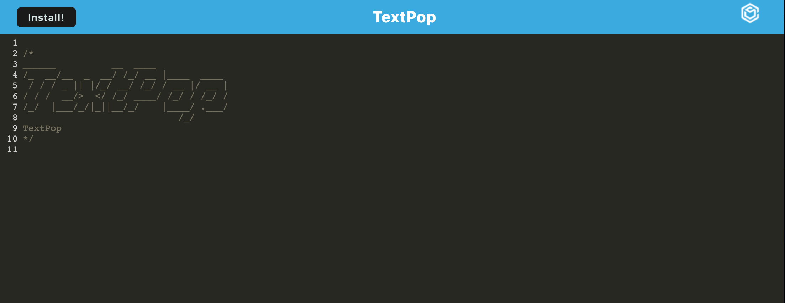

# TextPop

## Description

This program is desinged to be a text editor that works both in-browser as well as can be downloaded and used as a standalone app.

## Table of Contents

- [Installation](#installation)
- [Usage](#usage)
- [Contributing](#contributing)
- [License](#license)
- [Questions](#questions)

## Installation

Clone this project your personal computer using the command: 

	git clone git@github.com:avalynnw/TextPop.git

Then, use: 

	npm i

 to install the required dependencies in the root directory.

## Usage

Run the program from the root directory using:

	npm run start

and then you will be able to use the program at the URL:

    http://localhost:3000

### [Deployed Heroku Application](https://textpop.herokuapp.com/)

## Contributing

Collaborators: Avalynn Helgrave, https://github.com/avalynnw

Third-Party Assets: Modules: express, mongoose, nodemon

## License

#### The Unlicense

http://unlicense.org/

## Questions

https://github.com/avalynnw

 Contact me at: avalynnjudge@gmail.com
